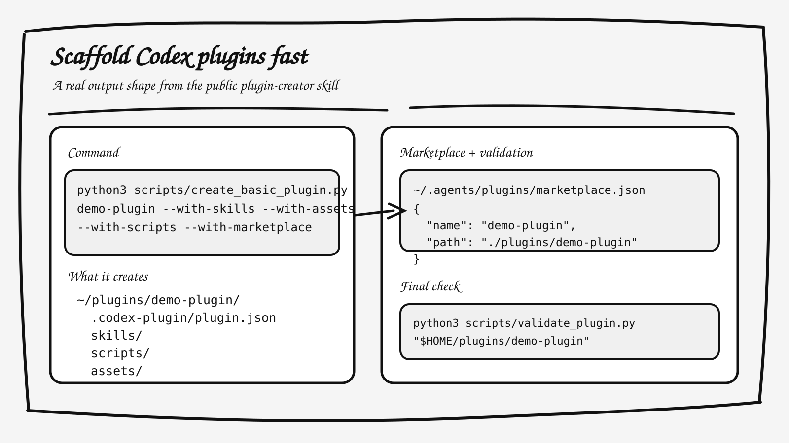

# Scaffold Codex Plugins Fast

`codex-plugin-creator` is a cleaned public extraction of Adam Holter's working `plugin-creator` skill for Codex.

It gives you a repeatable way to scaffold local Codex plugins with:

- a valid `.codex-plugin/plugin.json`
- optional `skills/`, `scripts/`, `assets/`, `.mcp.json`, and `.app.json`
- a matching marketplace entry when you want the plugin to show up in Codex UI
- a validator that catches bad manifest shape before you hand the plugin back



## Why This Exists

Codex plugin work gets messy fast when every new plugin starts from scratch.

The failure mode is usually not the idea. It is the packaging:

- wrong folder shape
- stale or missing manifest fields
- marketplace entries that do not match the plugin name
- unsupported keys that validation rejects later

This skill makes plugin setup deterministic and keeps the rules close to the scaffold.

## What You Get

- `SKILL.md`: the installable Codex skill
- `scripts/create_basic_plugin.py`: scaffold a plugin root and optional marketplace entry
- `scripts/validate_plugin.py`: validate the generated plugin against the expected manifest contract
- `references/plugin-json-spec.md`: exact sample shapes and field notes
- `agents/openai.yaml`: Codex skill metadata
- `assets/preview.svg`: a truthful preview diagram based on the generated output

## Quick Start

Install into your Codex skills directory:

```bash
mkdir -p "${CODEX_HOME:-$HOME/.codex}/skills"
cp -R codex-plugin-creator "${CODEX_HOME:-$HOME/.codex}/skills/plugin-creator"
```

From the installed skill directory:

```bash
python3 scripts/create_basic_plugin.py my-plugin --with-marketplace
python3 scripts/validate_plugin.py "$HOME/plugins/my-plugin"
```

By default this creates:

- `~/plugins/my-plugin`
- `~/.agents/plugins/marketplace.json`

## Example Output

Running:

```bash
python3 scripts/create_basic_plugin.py demo-plugin \
  --with-skills --with-scripts --with-assets --with-marketplace
```

Produces a plugin like:

```text
~/plugins/demo-plugin/
  .codex-plugin/plugin.json
  skills/
  scripts/
  assets/
```

And adds a marketplace entry at:

```text
~/.agents/plugins/marketplace.json
```

## Validation Notes

The bundled validator checks for:

- missing `.codex-plugin/plugin.json`
- invalid JSON
- unsupported manifest fields
- non-semver versions
- missing interface metadata
- broken asset paths
- leftover `[TODO: ...]` placeholders

## Security And Privacy

This public extraction does not include API keys, OAuth material, cookies, browser profiles, local session data, synced private notes, or Adam-specific project state.

The default scaffold targets generic local paths like `~/plugins` and `~/.agents/plugins/marketplace.json`. Those are defaults used by the tool, not personal machine identifiers.

## License

Apache-2.0
